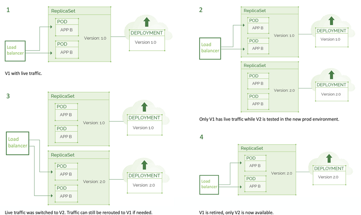

# 聊聊几种常见的发布方式

## 前言说明

首先区分2个概念：部署deploy和发布release

- 部署：在特定环境（包括生产环境）**安装**指定软件版本的过程，更多是一种技术行为
- 发布：向客户群提供新功能，是一种业务决策

## 蓝绿部署/发布

无论何时，只有一套生产环境有实时流量

- 蓝环境：当前版本并拥有实时流量
- 绿环境：更新代码的环境

蓝绿部署示意图：

## 金丝雀发布(灰度发布)

实时流量逐渐从旧版本迁移到新版本直到更新生效

- 2套生产环境，都有实时流量，但是流量的比例或者流量类型不一样。

- 可以通过自动化，将流量按照一定比率0，10%，50%，100%逐步转移到拥有更新代码的环境上。
- 发布过程中需要密切监控，一旦新环境发现问题，可以回滚或将流量重新打回原有环境，缩小问题影响规模。

金丝雀发布示意图：

## 参考文章

1. [一文搞懂蓝绿部署和金丝雀发布](https://segmentfault.com/a/1190000022448335)